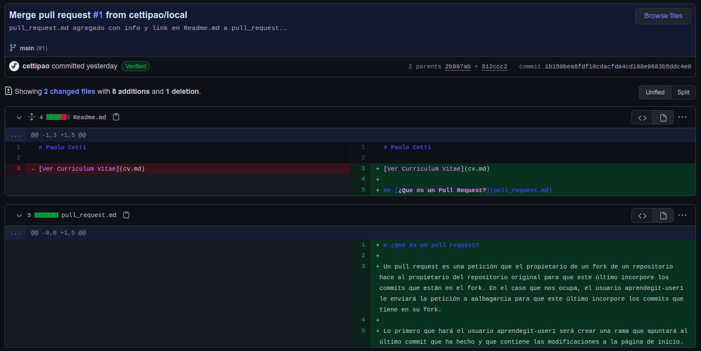
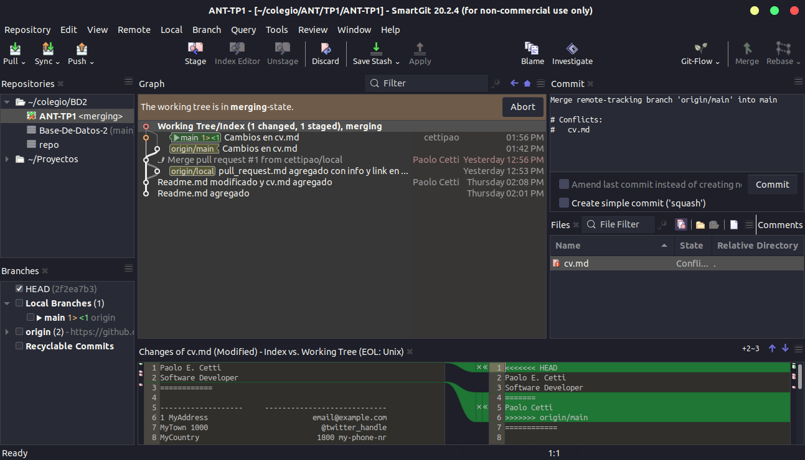
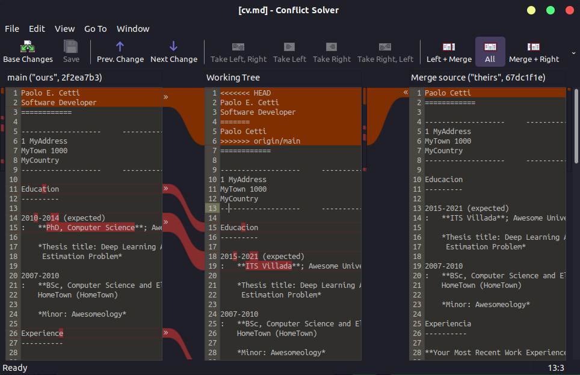
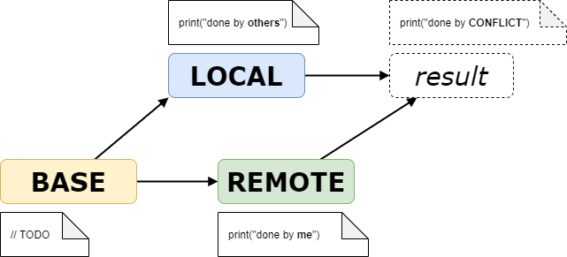
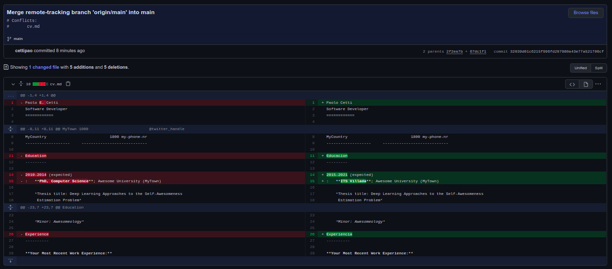
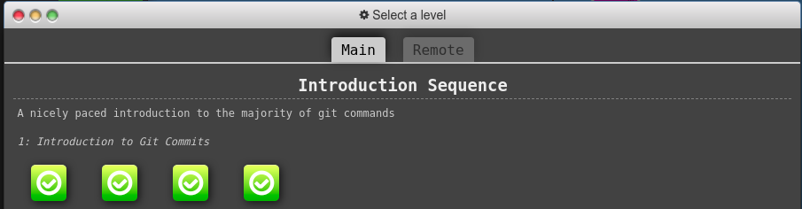

# Desarrollo
## Instalar Git

Ejecuto comando, ya lo tengo instalado. Para cliente visual uso Visual Studio Code

## Crear un repositorio local y agregar archivos

* Crear un repositorio local en un nuevo directorio.

``` bash
$ mkdir repo

$ cd repo

$ git init
Initialized empty Git repository in /home/cettipao/colegio/ANT/TP1/repo/.git/

```

* Agregar un archivo Readme.md, que contenga tu nombre y un link a tu CV. Tu cv será otro archivo en el mismo formato, en la misma carpeta.
* Crear los commits de cada caso y proveer mensajes descriptivos.

``` bash
$ touch Readme.md
$ git add Readme.md 
$ git commit -m "Readme.md agregado"
[master (root-commit) 238b200] Readme.md agregado
 1 file changed, 0 insertions(+), 0 deletions(-)
 create mode 100644 Readme.md

nano cv.md #Escribo datos al CV
nano Readme.md #Pongo nombre y Link al CV

$ git add .
$ git commit -m "Readme.md modificado y cv.md agregado"
[master 2b997ab] Readme.md modificado y cv.md agregado
 2 files changed, 96 insertions(+)
 create mode 100644 cv.md
```

## Crear un repositorio remoto

Cuenta: cettipao
Repositorio: [ANT-TP1](https://github.com/cettipao/ANT-TP1)

* Asociar el repositorio local creado en el punto 2 al creado en github.
* Subir los cambios locales a github.

``` bash
$ git remote add origin https://github.com/cettipao/ANT-TP1.git
$ git branch -M main
$ git push -u origin main
```

## Familiarizarse con el concepto de Pull Request

* Crear un branch local y agregar cambios a dicho branch.
    * El cambio debe ser un archivo md donde se explique que es un pull request y un link a éste en el readme.

``` bash
$ git branch local
$ git checkout local
Switched to branch 'local'

$ touch pull_request.md
$ nano pull_request.md #Escribo que es un pull request en el Markdown
$ nano Readme.md #Linkeo a pull_request.md
```

* Subir el cambio a dicho branch y crear un pull request.

``` bash
$ git add .
$ git commit -m "pull_request.md agregado con info y link en Readme.md a pull_request.md agregado"
$ git push origin local
...
```

* Completar el proceso de revisión en github y mergear el PR al branch master.

This branch has no conflicts with the base branch
Merging can be performed automatically.

Todo ok, sin conflictos. Se realiza el merge.



## Mergear código con conflictos

* Instalar alguna herramienta de comparación
    * Ejemplos: SmartGit, GitEye, plugin para vscode. pycharm, etc
* Clonar en un segundo directorio de tu equipo el repositorio creado en github.

``` bash
$ git clone https://github.com/cettipao/ANT-TP1.git
Cloning into 'ANT-TP1'...
remote: Enumerating objects: 12, done.
remote: Counting objects: 100% (12/12), done.
remote: Compressing objects: 100% (9/9), done.
remote: Total 12 (delta 0), reused 11 (delta 0), pack-reused 0
Unpacking objects: 100% (12/12), 3.14 KiB | 803.00 KiB/s, done.
```

* En el clon inicial, modificar el CV.md cambiando algunas lineas.

``` bash
$ nano cv.md
```

* Hacer commit y subir el cambio a master a github.

``` bash
$ git add .
$ git commit -m "Cambios en cv.md"
[main 67dc1f1] Cambios en cv.md
 1 file changed, 5 insertions(+), 5 deletions(-)
 $ git push origin main
 Username for 'https://github.com': cettipao
Password for 'https://cettipao@github.com': 
Enumerating objects: 5, done.
Counting objects: 100% (5/5), done.
Delta compression using up to 4 threads
Compressing objects: 100% (3/3), done.
Writing objects: 100% (3/3), 412 bytes | 412.00 KiB/s, done.
Total 3 (delta 1), reused 0 (delta 0)
remote: Resolving deltas: 100% (1/1), completed with 1 local object.
To https://github.com/cettipao/ANT-TP1.git
   1b159be..67dc1f1  main -> main
```

* En el segundo clon también realizar cambios en las mismas líneas que se modificaron en el otro directorio.

``` bash
$ nano cv.md
```

* Intentar subir el cambio, haciendo un commit y push. Mostrar el error que se obtiene.

``` bash
$ git add .
$ git commit -m "Cambios en cv.md"
[main 2f2ea7b] Cambios en cv.md
 1 file changed, 2 insertions(+), 1 deletion(-)
 $ git push origin main
Username for 'https://github.com': cettipao
Password for 'https://cettipao@github.com': 
To https://github.com/cettipao/ANT-TP1.git
 ! [rejected]        main -> main (fetch first)
error: failed to push some refs to 'https://github.com/cettipao/ANT-TP1.git'
hint: Updates were rejected because the remote contains work that you do
hint: not have locally. This is usually caused by another repository pushing
hint: to the same ref. You may want to first integrate the remote changes
hint: (e.g., 'git pull ...') before pushing again.
hint: See the 'Note about fast-forwards' in 'git push --help' for details.
```

* Hacer pull y mergear el código (solo texto por ahora), mostrar la herramienta de mergeo como luce.



* Resolver los conflictos del código.



* Explicar las versiones LOCAL, BASE y REMOTE.

En caso de pulling (merging) cambios de un repositorio en línea a su copia local, se puede entender REMOTO, LOCAL y BASE como:

REMOTE = El archivo local, incluidas sus propias modificaciones ('como en el sistema de archivos')
LOCAL = El archivo remoto dentro del repositorio en línea ('cambios realizados por otros usuarios')
BASE = El origen de ambos archivos ('sin modificaciones')



* Pushear el cambio mergeado.



## Algunos ejercicios online

* Entrar a la página <https://learngitbranching.js.org/>
* Completar los ejercicios Introduction Sequence

* Opcional - Completar el resto de los ejercicios para ser un experto en Git :D !!!

## Crear Repositorio de la materia
* Crear un [repositorio para la materia](https://github.com/cettipao/ANT) en github. Por ejemplo ANT (Diferente al de este trabajo práctico)
* Subir archivo(s) .md con los resultados, imágenes y/o videos de este trabajo práctico a ese repositorio. Puede ser en una subcarpeta trabajo-practico-01, con su propia rama, como mas le guste, pero en el README.md deberán explicar como encuentro el resultado.